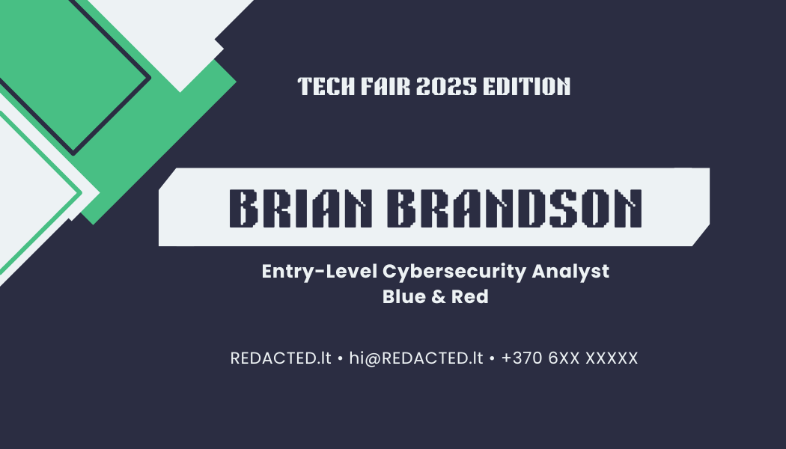
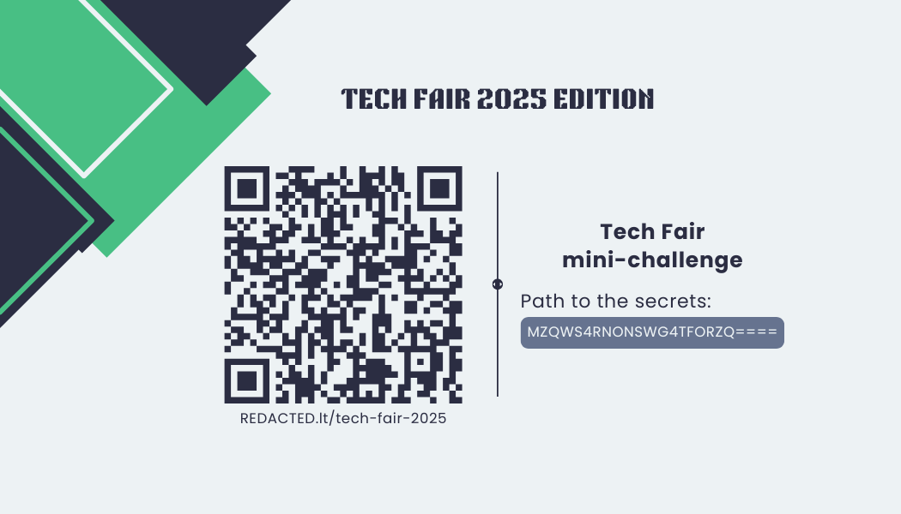

# ctf1.giedriussec.lt - Interactive Resume & CTF

## Overview

**ctf1.giedriussec.lt** is a personal cybersecurity portfolio site designed as a **gamified resume** - blending technical presentation with hands-on CTF mechanics.  
The idea was simple: anyone curious enough to dig into the site's details could discover hidden clues, uncover flags, and experience a glimpse of what it's like to investigate in a real security environment.

The project was built for the **2025 Tech Fair** as an experimental way to stand out when introducing myself to potential employers and peers.  
Even though I landed a job before the fair, the concept grew into a complete interactive showcase of creativity, technical depth, and attention to detail.

---

## Architecture & Technologies

- **Frontend:** Static site built with **Bootstrap** and custom styling.  
- **Hosting:** Deployed on shared Linux hosting using **DirectAdmin** with **Cloudflare** for DNS and HTTPS management.  
- **Routing & Logic:** Implemented via `.htaccess` files for custom HTTP headers and redirections.  
- **Backend Logic:** PHP scripts (`gateway.php`) handle flag validation and completion logic.
- **Challenges:** Embedded CTF elements based on DNS TXT records, HTTP headers, and encoded hints.  

The site contains two main sections:  
1. **Main resume page** - Clean one-pager highlighting skills, projects, and certifications.  
2. **CTF components** - Hidden routes (`/challenge`, `/secret`, `/gateway`, etc.) configured to reward technical curiosity.

---

## Physical Tech Fair Card
I designed and printed these cards to hand out at the 2025 Tech Fair. The QR code led to the `/fair-secrets` challenge path.

| Front | Back |
|:-----:|:----:|
|  |  |

---

## CTF Challenges

### **1. Tech Fair Challenge**
A short, self-contained challenge meant for visitors who received a physical card at the fair. It involves decoding a hidden path to reveal a playful congratulatory page.

### **2. Evergreen Secrets Hunter Challenge**
A deeper, multi-stage puzzle available from the main site.

- **Stage 1:** DNS Enumeration
- **Stage 2:** HTTP Header Analysis
- **Stage 3:** Cryptography & Encoding

*Want to see the answers? Check out [SOLUTIONS.md](SOLUTIONS.md) for a full walkthrough (Warning: Spoilers!).*

---

## Lessons Learned

- **CTF mechanics meet professional storytelling:** Blending challenge design with career branding creates genuine engagement.  
- **DNS and HTTP headers** can be creatively reused beyond security labs - as subtle communication channels.  
- **Cloudflare + .htaccess** integration taught fine-grained control over headers, HTTPS redirects, and caching behavior.  
- **Balancing simplicity and mystery:** Keeping puzzles approachable while still rewarding technical curiosity was key.  
- **Polish matters:** Even small UX touches (consistent palette, modal transitions, encoded hints) made the experience memorable.

---

## Credits & Attribution

Created by **Brian Brandson** (alias of *Giedrius A.*).  
Originally deployed at **[ctf1.giedriussec.lt](https://ctf1.giedriussec.lt)** - 2025 Tech Fair project and ongoing interactive resume experiment.  
All content, flags, and design concepts are original and developed as part of my cybersecurity career transition journey.
